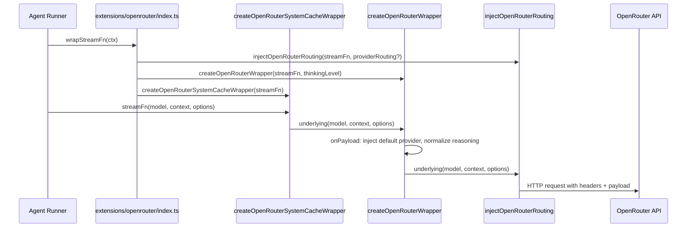

# Design Document: OpenRouter API Optimization

## Overview

This design covers four targeted patches to the OpenRouter API client layer. The changes harden request payloads against silent provider degradation, exploit Anthropic prompt caching, fix structured output header injection, and preserve model ID suffixes through the parsing pipeline.

All changes are confined to three files:

- `src/agents/pi-embedded-runner/proxy-stream-wrappers.ts` (Requirements 1, 2, 3)
- `extensions/openrouter/index.ts` (Requirement 1 — merge logic)
- `src/agents/model-selection.ts` (Requirement 4 — already correct, verified)

The wrapper chain order in `extensions/openrouter/index.ts` is:

1. `injectOpenRouterRouting` (optional, only when `extraParams.provider` is set)
2. `createOpenRouterWrapper` (headers + payload normalization + default provider routing)
3. `createOpenRouterSystemCacheWrapper` (Anthropic cache_control injection)

## Architecture

### Data Flow



### Header Precedence (Requirement 3)

Current header merge in `createOpenRouterWrapper`:

```typescript
headers: { ...attributionHeaders, ...options?.headers }
```

After change:

```typescript
headers: {
  ...attributionHeaders,
  ...options?.headers,
  "anthropic-beta": "structured-outputs-2025-11-13",
  "HTTP-Referer": "http://localhost:18789",
}
```

Wrapper-injected headers (`anthropic-beta`, `HTTP-Referer`) take highest precedence, overriding both attribution headers and caller-supplied headers. All other attribution headers (`X-OpenRouter-Title`, `X-OpenRouter-Categories`) pass through unchanged.

### Provider Payload Merge (Requirement 1)

The default provider payload is injected in `createOpenRouterWrapper`'s `onPayload` callback. When `injectOpenRouterRouting` has already set `model.compat.openRouterRouting`, the `onPayload` callback merges user overrides on top of the default:

```
final_provider = { ...DEFAULT_PROVIDER_PAYLOAD, ...model.compat.openRouterRouting }
```

This ensures every request gets the default quantization/routing constraints, while user-supplied `extraParams.provider` keys take precedence.

## Components and Interfaces

### 1. Default Provider Routing Constant

**File:** `src/agents/pi-embedded-runner/proxy-stream-wrappers.ts`

```typescript
const OPENROUTER_DEFAULT_PROVIDER_ROUTING: Record<string, unknown> = {
  allow_fallbacks: true,
  require_parameters: true,
  quantizations: ["fp16", "bf16", "fp8"],
  sort: { by: "throughput", partition: "none" },
  ignore: ["DeepInfra", "Baseten", "AtlasCloud"],
};
```

Exported as a module-level constant. Not exported (internal to the wrapper).

### 2. Modified `createOpenRouterWrapper`

**File:** `src/agents/pi-embedded-runner/proxy-stream-wrappers.ts`

Changes to the existing function:

**a) Header injection** — Add `anthropic-beta` and `HTTP-Referer` as wrapper-level headers that override attribution defaults:

```typescript
headers: {
  ...attributionHeaders,
  ...options?.headers,
  "anthropic-beta": "structured-outputs-2025-11-13",
  "HTTP-Referer": "http://localhost:18789",
}
```

**b) Provider payload injection** — In the `onPayload` callback, after `normalizeProxyReasoningPayload`, inject the default provider routing merged with any user overrides from `model.compat.openRouterRouting`:

```typescript
onPayload: (payload, model) => {
  normalizeProxyReasoningPayload(payload, thinkingLevel);
  const payloadObj = payload as Record<string, unknown>;
  const userRouting = (model as Record<string, unknown>)?.compat?.openRouterRouting;
  payloadObj.provider = {
    ...OPENROUTER_DEFAULT_PROVIDER_ROUTING,
    ...(userRouting && typeof userRouting === "object" ? userRouting : undefined),
  };
  return onPayload?.(payload, model);
};
```

Note: The `onPayload` callback receives `model` as its second argument (already the case in the existing code pattern). The `model.compat.openRouterRouting` field is set by `injectOpenRouterRouting` when user-supplied provider routing exists.

### 3. `createOpenRouterSystemCacheWrapper` (Requirement 2 — Existing)

**File:** `src/agents/pi-embedded-runner/proxy-stream-wrappers.ts`

Already implemented. No changes needed. Current behavior:

- Checks `isOpenRouterAnthropicModel(model.provider, model.id)` — true when provider is "openrouter" and model ID starts with "anthropic/"
- For `system`/`developer` role messages:
  - String content → converted to `[{ type: "text", text: content, cache_control: { type: "ephemeral" } }]`
  - Array content → `cache_control: { type: "ephemeral" }` attached to last element
- `user`/`assistant` messages are untouched

### 4. Model ID Parsing (Requirement 4 — Existing)

**File:** `src/agents/model-selection.ts`

Already correct. No changes needed. Current behavior:

- `parseModelRef("openrouter/hunter-alpha:nitro", "openrouter")` → splits on first `/` → `{ provider: "openrouter", model: "hunter-alpha:nitro" }`
- `normalizeProviderModelId("openrouter", "hunter-alpha:nitro")` → no `/` in model → prepends `openrouter/` → `"openrouter/hunter-alpha:nitro"`
- `normalizeProviderModelId("openrouter", "anthropic/claude-sonnet-4-5")` → has `/` → pass-through → `"anthropic/claude-sonnet-4-5"`
- `parseModelRef("openrouter/openrouter/hunter-alpha:nitro", "openrouter")` → splits on first `/` → provider="openrouter", model="openrouter/hunter-alpha:nitro" → has `/` → pass-through

The colon in `:nitro` is preserved because `indexOf("/")` splits only on slash, not colon.

## Data Models

### Provider Routing Payload Schema

```typescript
interface OpenRouterProviderRouting {
  allow_fallbacks: boolean;
  require_parameters: boolean;
  quantizations: string[];
  sort: { by: string; partition: string };
  ignore: string[];
}
```

This is injected at the root of the request body as `payload.provider`. The OpenRouter API uses this to control which backend providers handle the request.

### Header Set

| Header                    | Value                           | Source              | Precedence                      |
| ------------------------- | ------------------------------- | ------------------- | ------------------------------- |
| `HTTP-Referer`            | `http://localhost:18789`        | Wrapper constant    | Highest (overrides attribution) |
| `anthropic-beta`          | `structured-outputs-2025-11-13` | Wrapper constant    | Highest                         |
| `X-OpenRouter-Title`      | `OpenClaw`                      | Attribution headers | Base                            |
| `X-OpenRouter-Categories` | `cli-agent`                     | Attribution headers | Base                            |

### Model Reference Types (Existing)

```typescript
type ModelRef = { provider: string; model: string };
```

No changes to existing types.

## Correctness Properties

_A property is a characteristic or behavior that should hold true across all valid executions of a system — essentially, a formal statement about what the system should do. Properties serve as the bridge between human-readable specifications and machine-verifiable correctness guarantees._

### Property 1: Provider routing merge

_For any_ request payload and any optional user-supplied provider routing object, the final `payload.provider` in the request body SHALL equal the default provider routing merged with the user overrides (user keys taking precedence). When no user routing is supplied, the result SHALL equal the default provider routing exactly.

**Validates: Requirements 1.1, 1.2, 1.3**

### Property 2: System/developer cache_control injection

_For any_ Anthropic model request (provider="openrouter", model ID starting with "anthropic/") and any message with role "system" or "developer", the `createOpenRouterSystemCacheWrapper` SHALL produce a message whose content contains `cache_control: { type: "ephemeral" }`. For string content, the result is a single-element array with the cache_control attached. For array content, only the last element has cache_control attached.

**Validates: Requirements 2.1, 2.3, 2.4**

### Property 3: User/assistant messages are untouched

_For any_ message with role "user" or "assistant" passed through `createOpenRouterSystemCacheWrapper`, the message content SHALL be identical before and after the wrapper processes it, regardless of model or provider.

**Validates: Requirements 2.2**

### Property 4: Required headers present with correct precedence

_For any_ request sent through `createOpenRouterWrapper`, the final headers SHALL contain `anthropic-beta` with value `"structured-outputs-2025-11-13"`, `HTTP-Referer` with value `"http://localhost:18789"`, and all attribution headers (`X-OpenRouter-Title`, `X-OpenRouter-Categories`). The wrapper's `HTTP-Referer` SHALL override any value from attribution headers.

**Validates: Requirements 3.1, 3.2, 3.3, 3.4**

### Property 5: Model ID parse-normalize round trip

_For any_ valid OpenRouter model reference string (of the form `"openrouter/<model-id>"` where `<model-id>` may contain colons, slashes, or other characters), `parseModelRef` followed by `normalizeProviderModelId` SHALL produce a model ID that exactly matches the intended API model identifier. Specifically: for slash-less model IDs, `openrouter/` is prepended; for model IDs already containing `/`, the ID passes through unchanged.

**Validates: Requirements 4.1, 4.2, 4.3, 4.4, 4.5**

## Error Handling

### Invalid Payload Structure

If `payload` is not an object (null, undefined, primitive), `normalizeProxyReasoningPayload` already returns early. The new provider routing injection follows the same guard — it only writes to `payload.provider` when `payload` is a valid object.

### Missing Attribution Headers

`resolveProviderAttributionHeaders("openrouter")` may return `undefined` if the policy is disabled. The spread `{ ...undefined }` is a no-op in JavaScript, so the header merge is safe. The wrapper-level headers (`anthropic-beta`, `HTTP-Referer`) are always injected regardless.

### Malformed User Provider Routing

If `model.compat.openRouterRouting` is set but is not a plain object, the merge guard `typeof userRouting === "object"` prevents spreading non-objects. The default provider routing is used as-is in that case.

## Testing Strategy

### Property-Based Testing

Library: `fast-check` (already available in the project's test dependencies via Vitest).

Each property test runs a minimum of 100 iterations with randomly generated inputs.

Each test is tagged with a comment referencing the design property:

```
// Feature: openrouter-api-optimization, Property N: <title>
```

**Property 1 test** — Generate random payloads (objects with arbitrary keys) and optional user routing objects. Pass through the wrapper's onPayload. Assert the resulting `payload.provider` deep-equals `{ ...DEFAULT, ...userRouting }`.

**Property 2 test** — Generate random system/developer messages with either string or array content. Pass through `createOpenRouterSystemCacheWrapper` with an Anthropic model. Assert cache_control is present on the correct element.

**Property 3 test** — Generate random user/assistant messages. Pass through `createOpenRouterSystemCacheWrapper`. Assert content is unchanged (deep equality).

**Property 4 test** — Capture headers from `createOpenRouterWrapper` calls. Assert all four required headers are present with correct values, and that `HTTP-Referer` is the wrapper value, not the attribution value.

**Property 5 test** — Generate random model ID strings (with colons, slashes, alphanumeric). Run `parseModelRef("openrouter/" + modelId, "openrouter")` then `normalizeProviderModelId` on the result. Assert the output matches the expected API model ID.

### Unit Tests

Unit tests complement property tests for specific examples and edge cases:

- **Requirement 1**: Verify the exact default provider payload values. Verify that a user-supplied `{ quantizations: ["fp32"] }` overrides only that key.
- **Requirement 2**: Verify string-to-array conversion for a specific system message. Verify array content gets cache_control on last element only. Verify non-Anthropic models skip the wrapper.
- **Requirement 3**: Verify `anthropic-beta` header value is exactly `"structured-outputs-2025-11-13"`. Verify `HTTP-Referer` overrides the attribution value `"https://openclaw.ai"`.
- **Requirement 4**: Verify `parseModelRef("openrouter/hunter-alpha:nitro", "openrouter")` produces `{ provider: "openrouter", model: "hunter-alpha:nitro" }`. Verify double-prefix `"openrouter/openrouter/hunter-alpha:nitro"` splits correctly.

### Test File Locations

- `src/agents/pi-embedded-runner/proxy-stream-wrappers.test.ts` — Properties 1–4 and unit tests for Requirements 1–3
- `src/agents/model-selection.test.ts` — Property 5 and unit tests for Requirement 4 (extend existing test file)
