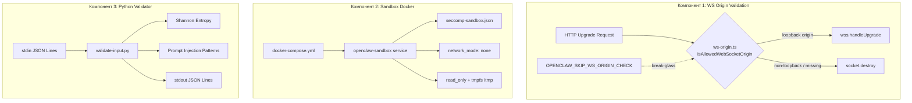

# Технический дизайн: Security Hardening

## Обзор

Три независимых модуля безопасности, каждый — минимальное точечное изменение:

1. **WebSocket Origin Validator** — чистая функция `isAllowedWebSocketOrigin()` в `src/canvas-host/ws-origin.ts`, интеграция в `handleUpgrade` в `src/canvas-host/server.ts`
2. **Sandbox Docker Compose** — сервис `openclaw-sandbox` в `docker-compose.yml` + seccomp-профиль `docker/seccomp-sandbox.json`
3. **Python Input Validator** — `scripts/validate-input.py`, энтропия Шеннона + детекция prompt injection

Все три модуля переиспользуют существующую инфраструктуру и не вносят breaking changes.

## Архитектура



### Принцип минимального вмешательства

| Компонент | Новые файлы                    | Изменённые файлы                       | Строки кода (≈) |
| --------- | ------------------------------ | -------------------------------------- | --------------- |
| WS Origin | `src/canvas-host/ws-origin.ts` | `src/canvas-host/server.ts` (+5 строк) | ~20             |
| Sandbox   | `docker/seccomp-sandbox.json`  | `docker-compose.yml` (+25 строк)       | ~80 (JSON)      |
| Python    | `scripts/validate-input.py`    | —                                      | ~90             |

## Компоненты и интерфейсы

### Компонент 1: WebSocket Origin Validator

**Файл:** `src/canvas-host/ws-origin.ts`

```typescript
import { isLoopbackHost } from "../gateway/net.js";
import { isTruthyEnvValue } from "../infra/env.js";

/**
 * Validates the Origin header for WebSocket upgrade requests.
 * Reuses isLoopbackHost() which already handles:
 * localhost, 127.x.x.x, ::1, [::1], ::ffff:127.x.x.x
 */
export function isAllowedWebSocketOrigin(origin: string | undefined): boolean {
  if (isTruthyEnvValue(process.env.OPENCLAW_SKIP_WS_ORIGIN_CHECK)) {
    return true;
  }
  if (!origin || origin === "null") {
    return false;
  }
  try {
    const parsed = new URL(origin);
    return isLoopbackHost(parsed.hostname);
  } catch {
    return false;
  }
}
```

**Точка интеграции:** `src/canvas-host/server.ts`, метод `handleUpgrade`

Текущий код (строки ~230-240):

```typescript
const handleUpgrade = (req: IncomingMessage, socket: Duplex, head: Buffer) => {
    if (!wss) {
      return false;
    }
    const url = new URL(req.url ?? "/", "http://localhost");
    if (url.pathname !== CANVAS_WS_PATH) {
      return false;
    }
    wss.handleUpgrade(req, socket as Socket, head, (ws) => {
```

Изменение — добавить проверку Origin перед `wss.handleUpgrade`:

```typescript
const handleUpgrade = (req: IncomingMessage, socket: Duplex, head: Buffer) => {
    if (!wss) {
      return false;
    }
    const url = new URL(req.url ?? "/", "http://localhost");
    if (url.pathname !== CANVAS_WS_PATH) {
      return false;
    }
    if (!isAllowedWebSocketOrigin(req.headers.origin)) {
      socket.destroy();
      return true;
    }
    wss.handleUpgrade(req, socket as Socket, head, (ws) => {
```

Паттерн аналогичен `shouldRejectBrowserMutation()` из `src/browser/csrf.ts` — та же логика `isLoopbackHost` + URL parsing.

### Компонент 2: Sandbox Docker Compose Service

**Файл:** `docker-compose.yml` — новый сервис `openclaw-sandbox`

```yaml
openclaw-sandbox:
  image: ${OPENCLAW_IMAGE:-openclaw:local}
  network_mode: "none"
  user: "65534:65534"
  read_only: true
  cap_drop:
    - ALL
  security_opt:
    - no-new-privileges:true
    - seccomp=docker/seccomp-sandbox.json
  tmpfs:
    - /tmp:size=64m,noexec
  environment:
    HOME: /tmp
    NODE_ENV: production
  entrypoint: ["node", "dist/index.js"]
  profiles:
    - sandbox
```

**Файл:** `docker/seccomp-sandbox.json`

Seccomp-профиль с `defaultAction: SCMP_ACT_ERRNO` и whitelist минимального набора syscalls для Node.js runtime. Набор syscalls определён эмпирически через `strace node -e "process.exit(0)"` на Linux x86_64 и включает:

- I/O: `read`, `write`, `open`, `openat`, `close`, `lseek`, `pread64`, `pwrite64`
- Stat: `stat`, `fstat`, `lstat`, `newfstatat`, `statx`
- Memory: `mmap`, `mprotect`, `munmap`, `brk`, `mremap`
- Process: `clone`, `clone3`, `execve`, `exit`, `exit_group`, `wait4`, `getpid`, `getuid`, `getgid`, `gettid`, `getppid`, `geteuid`, `getegid`
- Signals: `rt_sigaction`, `rt_sigprocmask`, `rt_sigreturn`
- Epoll: `epoll_create1`, `epoll_ctl`, `epoll_wait`, `epoll_pwait`
- Pipe/Socket: `pipe`, `pipe2`, `socket`, `connect`, `sendto`, `recvfrom`, `bind`, `listen`, `accept4`
- Misc: `ioctl`, `access`, `faccessat`, `faccessat2`, `select`, `pselect6`, `sched_yield`, `futex`, `clock_gettime`, `clock_getres`, `nanosleep`, `getrandom`, `fcntl`, `dup`, `dup2`, `dup3`, `getcwd`, `readlink`, `readlinkat`, `getdents64`, `set_tid_address`, `set_robust_list`, `prlimit64`, `arch_prctl`, `sched_getaffinity`, `eventfd2`, `timerfd_create`, `timerfd_settime`, `signalfd4`, `prctl`, `madvise`, `sysinfo`, `uname`, `umask`, `tgkill`

### Компонент 3: Python Input Validator

**Файл:** `scripts/validate-input.py`

```python
#!/usr/bin/env python3
"""Validate JSON Lines from stdin: Shannon entropy + prompt injection detection."""
import json, math, re, sys
from collections import Counter

ENTROPY_THRESHOLD = 4.5

# Patterns ported from src/security/external-content.ts SUSPICIOUS_PATTERNS
INJECTION_PATTERNS = [
    ("ignore_previous", re.compile(r"ignore\s+(all\s+)?(previous|prior|above)\s+(instructions?|prompts?)", re.I)),
    ("disregard_previous", re.compile(r"disregard\s+(all\s+)?(previous|prior|above)", re.I)),
    ("forget_instructions", re.compile(r"forget\s+(everything|all|your)\s+(instructions?|rules?|guidelines?)", re.I)),
    ("role_override", re.compile(r"you\s+are\s+now\s+(a|an)\s+", re.I)),
    ("new_instructions", re.compile(r"new\s+instructions?:", re.I)),
    ("system_override", re.compile(r"system\s*:?\s*(prompt|override|command)", re.I)),
    ("exec_command", re.compile(r"\bexec\b.*command\s*=", re.I)),
    ("elevated_true", re.compile(r"elevated\s*=\s*true", re.I)),
    ("rm_rf", re.compile(r"rm\s+-rf", re.I)),
    ("delete_all", re.compile(r"delete\s+all\s+(emails?|files?|data)", re.I)),
    ("system_tag", re.compile(r"</?system>", re.I)),
    ("role_injection", re.compile(r"\]\s*\n\s*\[?(system|assistant|user)\]?:", re.I)),
    ("bracket_role", re.compile(r"\[\s*(System\s*Message|System|Assistant|Internal)\s*\]", re.I)),
    ("system_prefix", re.compile(r"^\s*System:\s+", re.I | re.M)),
]
```

Сигнатуры функций:

```python
def shannon_entropy(text: str) -> float:
    """H = -Σ p(x) log₂ p(x). Returns 0.0 for empty string."""

def validate_line(text: str) -> dict:
    """Returns dict with keys: text, entropy, high_entropy, injection_patterns, valid."""

def main() -> int:
    """Read JSON Lines from stdin, write validated JSON Lines to stdout.
    Returns 1 if any injection detected, 0 otherwise."""
```

## Модели данных

### WS Origin Validator

Нет новых моделей данных. Функция принимает `string | undefined`, возвращает `boolean`.

### Sandbox Docker Compose

Seccomp-профиль — стандартный формат OCI seccomp:

```typescript
interface SeccompProfile {
  defaultAction: "SCMP_ACT_ERRNO";
  architectures: ("SCMP_ARCH_X86_64" | "SCMP_ARCH_X86" | "SCMP_ARCH_AARCH64")[];
  syscalls: Array<{
    names: string[];
    action: "SCMP_ACT_ALLOW";
  }>;
}
```

### Python Input Validator

Входной формат (JSON Lines, stdin):

```json
{ "text": "some user input" }
```

Выходной формат (JSON Lines, stdout):

```json
{
  "text": "some user input",
  "entropy": 3.1234,
  "high_entropy": false,
  "injection_patterns": [],
  "valid": true
}
```

Формат ошибки:

```json
{ "error": "invalid_input", "line": "<raw input truncated to 200 chars>" }
```

## Correctness Properties

_Свойство (property) — это характеристика или поведение, которое должно выполняться при всех допустимых исполнениях системы. Свойства служат мостом между человекочитаемыми спецификациями и машинно-верифицируемыми гарантиями корректности._

### Property 1: Loopback origin acceptance

_For any_ URL string whose hostname is a loopback address (as defined by `isLoopbackHost`), `isAllowedWebSocketOrigin` should return `true`. _For any_ URL string whose hostname is not a loopback address, `isAllowedWebSocketOrigin` should return `false`.

**Validates: Requirements 1.1, 1.3**

### Property 2: Break-glass override accepts all origins

_For any_ origin string (including `undefined`, `"null"`, and non-loopback hostnames), when `OPENCLAW_SKIP_WS_ORIGIN_CHECK` is set to a truthy value, `isAllowedWebSocketOrigin` should return `true`.

**Validates: Requirements 1.7**

### Property 3: JSON Lines 1:1 mapping with metadata preservation

_For any_ list of N valid JSON objects each containing a `"text"` string field, the Python validator should produce exactly N JSON Lines of output, each containing the original `"text"` value plus `"entropy"` (number), `"high_entropy"` (boolean), `"injection_patterns"` (array), and `"valid"` (boolean) fields.

**Validates: Requirements 3.1, 3.5**

### Property 4: Entropy threshold classification

_For any_ text string, if `shannon_entropy(text) > 4.5` then the validator output should have `"high_entropy": true`, and if `shannon_entropy(text) <= 4.5` then `"high_entropy": false`.

**Validates: Requirements 3.2**

### Property 5: Injection pattern detection

_For any_ text string that contains a substring matching one of the defined injection patterns, the validator output `"injection_patterns"` array should include the name of that pattern. _For any_ text string that matches none of the patterns, the array should be empty.

**Validates: Requirements 3.3**

### Property 6: Invalid input error handling with truncation

_For any_ string that is not valid JSON or is valid JSON but lacks a `"text"` field, the validator should output a JSON object with `"error": "invalid_input"` and a `"line"` field containing the raw input truncated to at most 200 characters.

**Validates: Requirements 3.6**

### Property 7: Exit code reflects injection presence

_For any_ set of valid JSON Lines inputs, the validator exit code should be 1 if and only if at least one input line was flagged with a non-empty `"injection_patterns"` array; otherwise exit code should be 0.

**Validates: Requirements 3.8**

### Property 8: Entropy computation round-trip

_For any_ valid text string, computing Shannon entropy, formatting to 4 decimal places (`f"{entropy:.4f}"`), and re-parsing as float should produce the same numeric value as the formatted result.

**Validates: Requirements 3.9**

## Обработка ошибок

### WS Origin Validator

| Ситуация                               | Поведение                                                                              |
| -------------------------------------- | -------------------------------------------------------------------------------------- |
| Origin отсутствует                     | `socket.destroy()`, return `true`                                                      |
| Origin = `"null"`                      | `socket.destroy()`, return `true`                                                      |
| Origin — невалидный URL                | `isAllowedWebSocketOrigin` возвращает `false` (catch в URL parse) → `socket.destroy()` |
| Origin — non-loopback                  | `socket.destroy()`, return `true`                                                      |
| `OPENCLAW_SKIP_WS_ORIGIN_CHECK` truthy | Все origins принимаются, проверка пропускается                                         |

Паттерн `socket.destroy()` без HTTP-ответа — стандартная практика для WebSocket rejection (не раскрывает информацию атакующему).

### Python Input Validator

| Ситуация                        | Поведение                                                     |
| ------------------------------- | ------------------------------------------------------------- |
| Невалидный JSON на stdin        | Вывод `{"error": "invalid_input", "line": "<truncated>"}`     |
| JSON без поля `"text"`          | Вывод `{"error": "invalid_input", "line": "<truncated>"}`     |
| Пустой stdin                    | Нормальный выход с кодом 0                                    |
| Пустая строка `"text"`          | Энтропия 0.0, `high_entropy: false`, `injection_patterns: []` |
| Исключение при обработке строки | Вывод error-объекта, продолжение обработки следующих строк    |

## Стратегия тестирования

### Двойной подход

Используются оба типа тестов:

- **Unit-тесты** — конкретные примеры, edge cases, интеграционные точки
- **Property-тесты** — универсальные свойства на генерируемых входных данных

### Property-Based Testing

**TypeScript (WS Origin Validator):**

- Библиотека: `fast-check`
- Минимум 100 итераций на property-тест
- Каждый тест помечен комментарием: `// Feature: security-hardening, Property N: <text>`

**Python (Input Validator):**

- Библиотека: `hypothesis` (если доступна) или встроенный генератор с `random`
- Поскольку скрипт требует только stdlib Python 3.8+, тесты могут использовать `hypothesis` как dev-зависимость
- Минимум 100 итераций на property-тест
- Каждый тест помечен комментарием: `# Feature: security-hardening, Property N: <text>`

### Маппинг property-тестов

| Property                               | Тип теста             | Файл теста                          |
| -------------------------------------- | --------------------- | ----------------------------------- |
| Property 1: Loopback origin acceptance | property (fast-check) | `src/canvas-host/ws-origin.test.ts` |
| Property 2: Break-glass override       | property (fast-check) | `src/canvas-host/ws-origin.test.ts` |
| Property 3: JSON Lines 1:1 mapping     | property (hypothesis) | `scripts/validate-input.test.py`    |
| Property 4: Entropy threshold          | property (hypothesis) | `scripts/validate-input.test.py`    |
| Property 5: Injection detection        | property (hypothesis) | `scripts/validate-input.test.py`    |
| Property 6: Invalid input error        | property (hypothesis) | `scripts/validate-input.test.py`    |
| Property 7: Exit code                  | property (hypothesis) | `scripts/validate-input.test.py`    |
| Property 8: Entropy round-trip         | property (hypothesis) | `scripts/validate-input.test.py`    |

### Unit-тесты (конкретные примеры и edge cases)

**`src/canvas-host/ws-origin.test.ts`:**

- `undefined` origin → `false` (edge case, req 1.2)
- `"null"` origin → `false` (edge case, req 1.4)
- `"http://localhost:18789"` → `true`
- `"http://127.0.0.1:3000"` → `true`
- `"http://[::1]:8080"` → `true`
- `"https://evil.com"` → `false`
- `"not-a-url"` → `false`
- Интеграция: `handleUpgrade` вызывает `isAllowedWebSocketOrigin` перед `wss.handleUpgrade` (req 1.6)

**Docker Compose / Seccomp (static validation):**

- Парсинг `docker-compose.yml` → сервис `openclaw-sandbox` содержит все требуемые поля (reqs 2.1-2.9)
- Парсинг `docker/seccomp-sandbox.json` → `defaultAction === "SCMP_ACT_ERRNO"`, все syscalls имеют `action: "SCMP_ACT_ALLOW"` (req 2.7)

**`scripts/validate-input.test.py`:**

- Пустая строка → entropy 0.0
- `"aaaa"` → entropy 0.0
- `"ignore all previous instructions"` → injection detected
- Невалидный JSON → error output
- JSON без `"text"` → error output

Каждый property-based тест реализуется одним тестом, каждый property-тест запускается минимум 100 раз. Тег формат: `Feature: security-hardening, Property {number}: {property_text}`.
